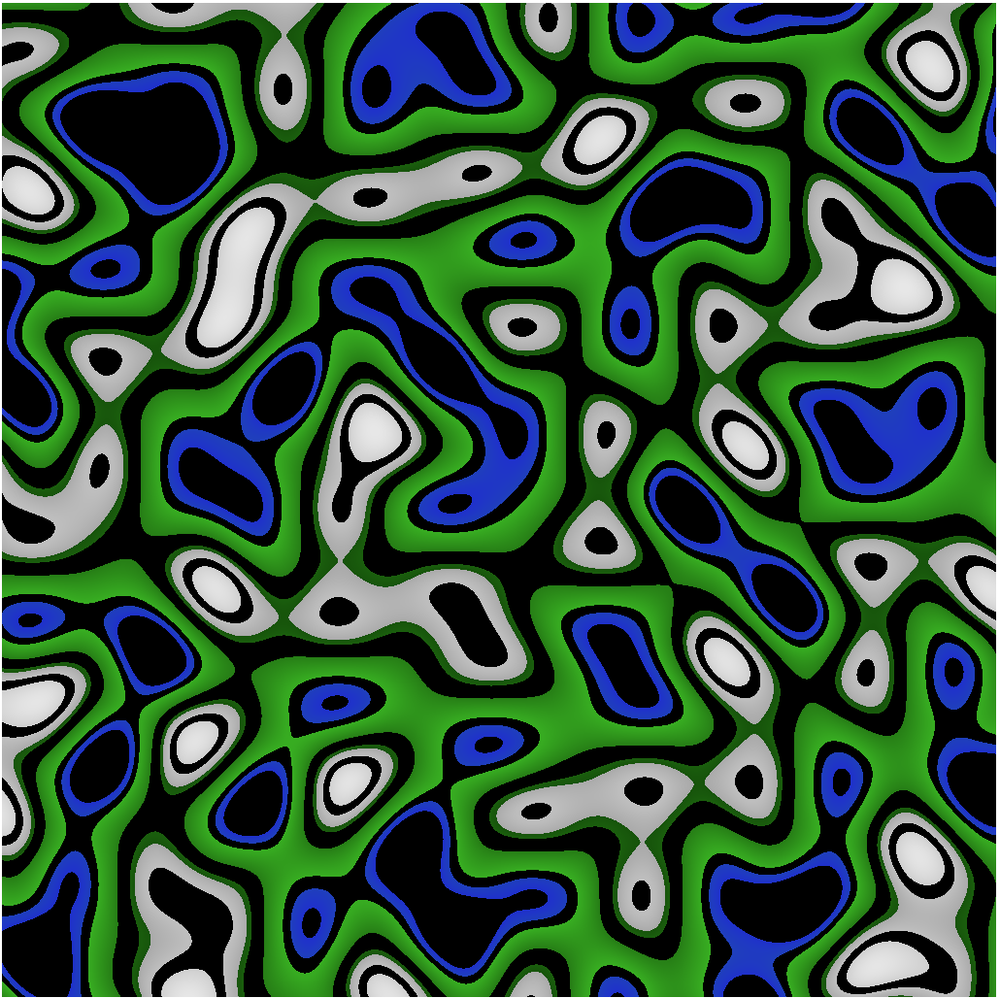

Basic Marching Squares Algorithm Implemented using WebGPU.

All the 16 cases for the squares are handled within the shader itself. 

Currently uses Perlin Noise, sourced from here -- https://github.com/josephg/noisejs

Future upgrades 

--> Test more initialization cases. 

--> Better way of implemented fragment shader --> Maybe implement adding gradients
      
--> Try realtime updates in the initialization grid? Using Compute shaders?

--> Marching Cubes?
                
